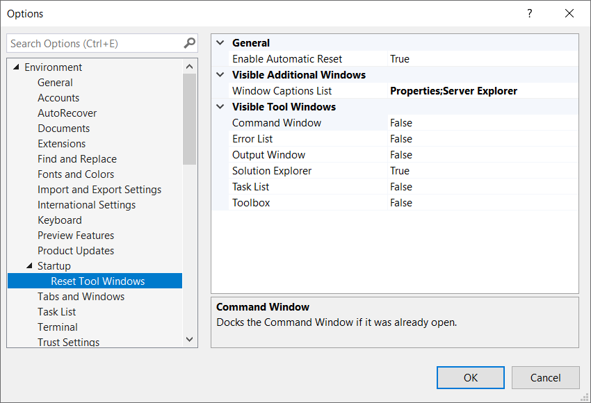

# Reset Tool Windows

Download the extension at the
[Visual Studio Marketplace](https://marketplace.visualstudio.com/items?itemName=MadsKristensen.ResetToolWindow)
or try the
[CI build](http://vsixgallery.com/extension/MadsKristensen.ResetToolWindow/).

---------------------------------------

Collapse all tool windows except the ones you really need visible and gain 10-33% faster Visual Studio startup times and a fresh starting point every day.

Select which of the known high-performance tool windows to leave docked when all others will auto-hide. 

Choose between:

* Command Window
* Error List
* Output Window
* Solution Explorer
* Task List
* Toolbox

## License
[Apache 2.0](LICENSE)
